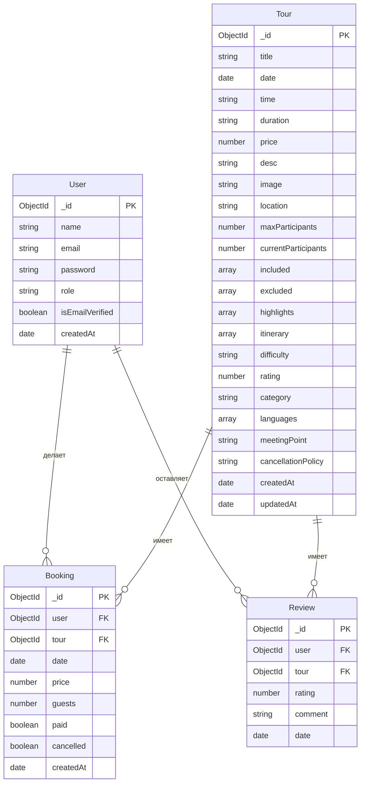

# Схема базы данных ТурПро

## ER Диаграмма

## Описание сущностей

### User (Пользователь)
- Основная сущность для хранения данных пользователей
- Содержит аутентификационные данные и основную информацию
- Связан с бронированиями (один ко многим)
- Связан с отзывами (один ко многим)

### Tour (Тур)
- Центральная сущность системы
- Содержит всю информацию о туристических турах
- Включает детали, расписание и ограничения
- Связан с бронированиями (один ко многим)
- Связан с отзывами (один ко многим)

### Booking (Бронирование)
- Связующая сущность между пользователем и туром
- Отслеживает статус бронирования и оплаты
- Хранит информацию о количестве гостей и стоимости
- Имеет статусы оплаты и отмены

### Review (Отзыв)
- Хранит отзывы пользователей о турах
- Включает рейтинг и текстовый комментарий
- Связывает пользователя и тур

## Основные связи

1. User -> Booking: Один пользователь может иметь множество бронирований
2. Tour -> Booking: Один тур может иметь множество бронирований
3. User -> Review: Один пользователь может оставить множество отзывов
4. Tour -> Review: Один тур может иметь множество отзывов

## Индексы

### Tour
- `{ date: 1 }`: Для быстрого поиска туров по дате
- `{ category: 1 }`: Для фильтрации по категориям

### Booking
- `{ user: 1, tour: 1 }`: Для быстрого поиска бронирований пользователя
- `{ date: 1 }`: Для поиска бронирований по дате

## Виртуальные поля

### Tour
- `availableSpots`: Вычисляет количество доступных мест
- `isAvailable`: Определяет, доступен ли тур для бронирования 